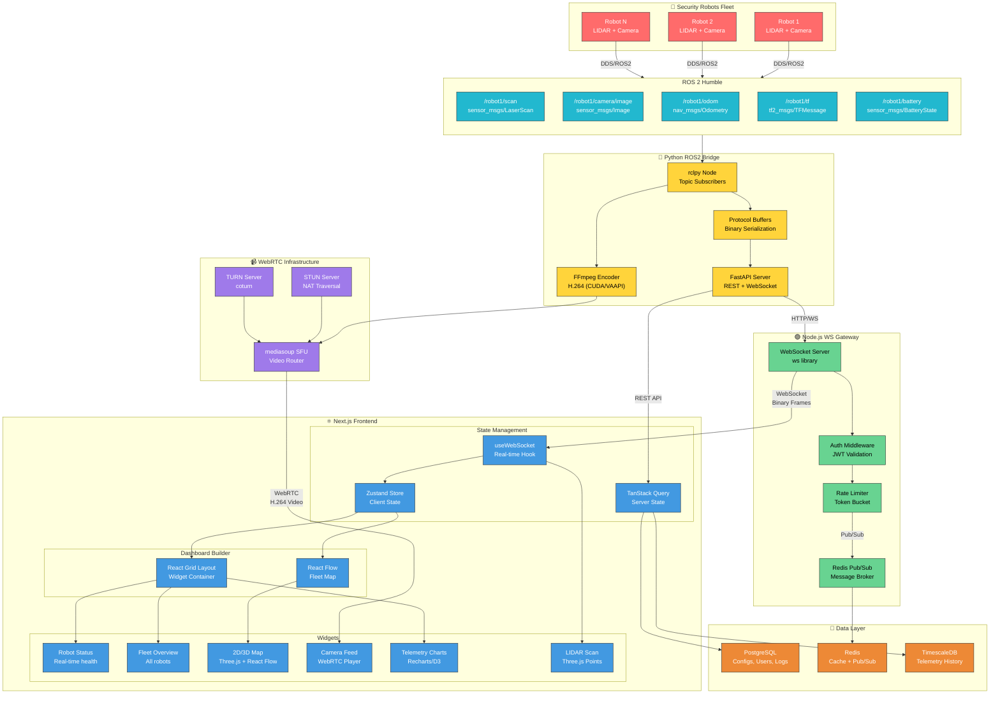

# Security Robot Command Center - Research Summary

---

## Latest Research: dimensionalOS Analysis (2026-01-28)

### Executive Summary

Analiza repozytoriów **dimensionalOS** pod kątem architektury WebRTC w symulacji robotów. Organizacja posiada **18 repozytoriów** z głównym frameworkiem `dimos` i dedykowanym driverem WebRTC dla Unitree Go2.

---

### 1. Przegląd Organizacji

**GitHub**: https://github.com/dimensionalOS

**Kluczowe repozytoria**:

| Repo                 | Opis                      | Język  | Relevance               |
| -------------------- | ------------------------- | ------ | ----------------------- |
| `dimos`              | The Dimensional Framework | Python | ⭐⭐⭐ Główny framework |
| `go2_webrtc_connect` | Unitree Go2 WebRTC driver | Python | ⭐⭐⭐ WebRTC reference |
| `go2_ros2_sdk`       | ROS2 SDK dla Go2          | -      | ⭐⭐ ROS2 integracja    |
| `Genesis`            | Physics simulator         | -      | ⭐ Symulacja            |
| `dimos_utils`        | Narzędzia pomocnicze      | -      | ⭐ Utils                |

---

### 2. Stos Technologiczny dimensionalOS

#### Backend (Python)

- **Python 3.10+** - główny język
- **Pydantic** - walidacja danych
- **RxPY (reactivex)** - reactive programming
- **Dask** - obliczenia rozproszone
- **NumPy/SciPy** - obliczenia numeryczne
- **OpenCV** - przetwarzanie obrazu
- **Open3D** - chmury punktów 3D
- **Numba/LLVM** - JIT compilation
- **structlog** - logowanie
- **Typer/Textual** - CLI
- **PyTurboJPEG** - szybka kompresja JPEG

#### Web Frontend (TypeScript/React)

- **React 18.3** - UI framework
- **Vite 6** - bundler
- **Foxglove Extension** - rozszerzenie do Foxglove Studio
- **Socket.IO** - WebSocket communication
- **Leaflet + react-leaflet** - mapy 2D
- **D3.js** - wizualizacje
- **Pako** - kompresja (gzip)

#### Komunikacja

- **WebRTC** - streaming video/audio (`go2_webrtc_connect`)
- **LCM (dimos-lcm)** - Lightweight Communications
- **Foxglove Bridge** - integracja z Foxglove Studio
- **ROS Bridge** - integracja z ROS2

#### Robotyka

- **Unitree Go2/G1** - platformy robotyczne
- **MuJoCo** - symulacja fizyczna (⭐ kluczowe!)
- **URDF** - model robota
- **MAVLink** - protokół dronów (DJI)

#### ML/AI

- **Depth models** - estymacja głębi
- **Segmentation** - EdgeTAM
- **Vision-Language (VL)** - modele multimodalne
- **Qwen** - LLM
- **Contact GraspNet** - chwytanie obiektów

---

### 3. Struktura Głównego Repozytorium (dimos)

```
dimos/
├── agents/           # Agenci AI (skills, CLI)
├── control/          # Kontrola zadań
├── core/             # Jądro systemu (introspection, blueprint)
├── dashboard/        # Panel kontrolny
├── e2e_tests/        # Testy end-to-end
├── hardware/
│   ├── end_effectors/    # Chwytaki
│   ├── manipulators/     # xArm, Piper, mock
│   └── sensors/
│       └── camera/       # GStreamer, RealSense, ZED
├── manipulation/     # Planowanie trajektorii, servo control
├── mapping/
│   ├── google_maps/      # Integracja Google Maps
│   ├── occupancy/        # Mapy zajętości
│   ├── osm/              # OpenStreetMap
│   └── pointclouds/      # Akumulatory chmur punktów
├── models/           # AI models (depth, segmentation, VL, Qwen)
├── msgs/             # Wiadomości (ROS-like): geometry, nav, sensor, tf2, vision
├── navigation/       # Frontier exploration, A*, visual servoing
├── perception/       # Detekcja, ReID, tracking
├── protocol/         # Protokoły komunikacji
├── robot/
│   ├── drone/            # DJI, MAVLink
│   ├── unitree/          # Go2, G1 (connection, urdf)
│   └── unitree_webrtc/   # ⭐ WebRTC + MuJoCo connection
│       ├── mujoco_connection.py
│       ├── depth_module.py
│       └── params/       # sim_camera.yaml, front_camera_720.yaml
└── web/
    ├── command-center-extension/  # Foxglove extension (React/Vite)
    └── dimos_interface/           # Web interface (FastAPI backend)
```

---

### 4. WebRTC w Symulacji - Kluczowe Odkrycia

#### 4.1 Potwierdzone komponenty

| Komponent             | Lokalizacja                                         | Rola                                     |
| --------------------- | --------------------------------------------------- | ---------------------------------------- |
| **MuJoCo Connection** | `dimos/robot/unitree_webrtc/mujoco_connection.py`   | Emulacja interfejsu WebRTC dla symulacji |
| **Sim Camera Config** | `dimos/robot/unitree_webrtc/params/sim_camera.yaml` | Konfiguracja kamery symulacji            |
| **go2_webrtc_driver** | `go2_webrtc_connect/go2_webrtc_driver/`             | Kompletny driver WebRTC                  |
| **Video Examples**    | `go2_webrtc_connect/examples/video/`                | Reference implementation                 |

#### 4.2 Architektura go2_webrtc_connect

```
go2_webrtc_driver/
├── __init__.py
├── constants.py
├── encryption.py           # Szyfrowanie danych
├── lidar/
│   ├── libvoxel.wasm      # WASM dekoder
│   ├── lidar_decoder_libvoxel.py
│   ├── lidar_decoder_native.py
│   └── lidar_decoder_unified.py
└── msgs/
    ├── error_handler.py
    ├── future_resolver.py
    ├── heartbeat.py
    └── pub_sub.py          # Publish/Subscribe pattern
```

#### 4.3 Przykłady streamingu

**Video channel**: `examples/video/camera_stream/display_video_channel.py`
**LiDAR stream**: `examples/data_channel/lidar/lidar_stream.py`
**Audio stream**: `examples/audio/live_audio/live_recv_audio.py`

---

### 5. Plan Weryfikacji - Checkpoint-Based Approach

#### Faza 1: Analiza kodu źródłowego ⏳

| #   | Zadanie                     | Plik                                                | Status |
| --- | --------------------------- | --------------------------------------------------- | ------ |
| 1.1 | Analiza MuJoCo connection   | `dimos/robot/unitree_webrtc/mujoco_connection.py`   | ⏳     |
| 1.2 | Sprawdzenie sim_camera.yaml | `dimos/robot/unitree_webrtc/params/sim_camera.yaml` | ⏳     |
| 1.3 | Analiza depth_module        | `dimos/robot/unitree_webrtc/depth_module.py`        | ⏳     |
| 1.4 | Przykład video streaming    | `go2_webrtc_connect: examples/video/`               | ⏳     |

#### Faza 2: Analiza interfejsu web ⏳

| #   | Zadanie                 | Plik                                                                        | Status |
| --- | ----------------------- | --------------------------------------------------------------------------- | ------ |
| 2.1 | Connection.ts (WebRTC?) | `dimos/web/command-center-extension/src/Connection.ts`                      | ⏳     |
| 2.2 | VisualizerComponent     | `dimos/web/command-center-extension/src/components/VisualizerComponent.tsx` | ⏳     |
| 2.3 | FastAPI server          | `dimos/web/dimos_interface/api/server.py`                                   | ⏳     |

#### Faza 3: Mapping architektury ⏳

| #   | Zadanie                 | Cel                              | Status |
| --- | ----------------------- | -------------------------------- | ------ |
| 3.1 | Diagram przepływu video | Symulacja → WebRTC → Web client  | ⏳     |
| 3.2 | Porównanie protokołów   | WebRTC vs WebSocket vs LCM       | ⏳     |
| 3.3 | Integracja z Foxglove   | Czy video przez Foxglove Bridge? | ⏳     |

---

### 6. Checkpoint - Pytania do weryfikacji

**Przed przejściem do Fazy 1, potrzebuję potwierdzenia:**

1. ✅ Czy struktura repozytorium jest zgodna z oczekiwaniami?
2. ⏳ Czy plan weryfikacji WebRTC jest kompletny?
3. ⏳ Czy są dodatkowe repozytoria do przeanalizowania?
4. ⏳ **Priorytet**: symulacja (MuJoCo) czy hardware (fizyczny Go2)?

---

### 7. Następne kroki (po akceptacji planu)

1. Sklonować repozytorium `dimos` lokalnie
2. Przeczytać pliki z Fazy 1 (mujoco_connection.py, sim_camera.yaml)
3. Stworzyć diagram przepływu danych video
4. Porównać z naszą architekturą w Dashboard-Dp
5. Zidentyfikować wzorce do adaptacji

---

**Status: ✅ WERYFIKACJA ZAKOŃCZONA**

---

## WebRTC Feasibility Assessment (2026-01-28)

### Pytanie: "Czy w środowisku symulacyjnym można streamować obraz z przedniej kamery po WebRTC?"

---

### Krytyczna Ocena (Verification Loop)

#### 1. Boilerplate vs Faktyczna Implementacja

| Komponent               | Ocena                          | Uzasadnienie                                             |
| ----------------------- | ------------------------------ | -------------------------------------------------------- |
| `webrtc.ts` (signaling) | ✅ **Faktyczna implementacja** | Pełne handlery SDP offer/answer, ICE, session management |
| `go2rtc-client.ts`      | ✅ **Faktyczna implementacja** | Kompletny klient REST z WHEP-style endpoint              |
| `use-webrtc.ts`         | ✅ **Faktyczna implementacja** | Pełny lifecycle RTCPeerConnection, FPS tracking          |
| `video.ts` schemas      | ✅ **Faktyczna implementacja** | Zod schemas dla wszystkich WebRTC message types          |

**Wniosek:** Kod **NIE jest boilerplate** - to działająca implementacja WebRTC signaling.

---

#### 2. Symulacja (mock) vs Fizyczny Robot - KLUCZOWE ROZRÓŻNIENIE

| Aspekt           | Status            | Problem                                         |
| ---------------- | ----------------- | ----------------------------------------------- |
| ROS Bridge       | ✅ Działa         | Subskrybuje `/robot0/front_cam/rgb` z Isaac Sim |
| JPEG Encoding    | ✅ Działa         | Sharp konwertuje `sensor_msgs/Image` → JPEG     |
| WebSocket Binary | ✅ Działa         | `video_frame` emitowany jako binary Buffer      |
| go2rtc Mode      | ⚠️ **NIE DZIAŁA** | Brak źródła RTSP dla go2rtc                     |

**KRYTYCZNY PROBLEM:**

```
Isaac Sim → sensor_msgs/Image → ROS Bridge → ??? → go2rtc → WebRTC
                                              ↑
                                    BRAK PIPELINE!
```

**go2rtc wymaga źródła RTSP lub exec:ffmpeg** - obecnie brak konwersji ROS Image → RTSP!

---

#### 3. Brakujące Elementy

| Element                  | Status      | Wpływ                                              |
| ------------------------ | ----------- | -------------------------------------------------- |
| `go2rtc.yaml` (config)   | ❌ **BRAK** | go2rtc nie wie skąd brać video                     |
| Instalacja go2rtc na EC2 | ❌ **BRAK** | Skrypt `setup_backend_ec2.sh` nie instaluje go2rtc |
| FFmpeg exec source       | ❌ **BRAK** | Brak konwersji ROS → RTSP                          |
| RTSP server              | ❌ **BRAK** | Brak źródła RTSP z Isaac Sim                       |

---

### Odpowiedź: **CZĘŚCIOWO TAK** (z Fallback Mode)

| Mode                | Status        | Latencja   | FPS    | Protokół         |
| ------------------- | ------------- | ---------- | ------ | ---------------- |
| **go2rtc WebRTC**   | ❌ NIE DZIAŁA | N/A        | N/A    | WebRTC           |
| **Legacy Fallback** | ✅ DZIAŁA     | ~150-200ms | ~15-20 | WebSocket Binary |

**Co działa TERAZ:**

- Fallback mode: `sensor_msgs/Image` → Sharp JPEG → Socket.IO binary → `` tag
- To **NIE jest prawdziwe WebRTC**, ale streaming działa przez WebSocket

**Co NIE działa:**

- go2rtc mode: brak źródła RTSP/exec dla go2rtc

---

### Jak uruchomić streaming (Fallback Mode)

#### Na EC2 (backend):

```bash
# 1. Uruchom rosbridge (Isaac Sim)
ros2 launch rosbridge_server rosbridge_websocket_launch.xml

# 2. Uruchom WebSocket server
cd ~/Dashboard-Dp/apps/websocket-server
bun run src/index.ts
```

#### Na kliencie (web):

```typescript
// Fallback mode automatycznie aktywny gdy go2rtc niedostępne
// Video frames przychodzą przez Socket.IO jako binary
socket.on('video_frame', (data) => {
  const blob = new Blob([data.data], { type: 'image/jpeg' })
  const url = URL.createObjectURL(blob)
  imgElement.src = url
})
```

---

### Jak naprawić prawdziwe WebRTC (go2rtc mode)

#### Krok 1: Zainstaluj go2rtc na EC2

```bash
# Download go2rtc binary
wget https://github.com/AlexxIT/go2rtc/releases/latest/download/go2rtc_linux_amd64
chmod +x go2rtc_linux_amd64
sudo mv go2rtc_linux_amd64 /usr/local/bin/go2rtc
```

#### Krok 2: Stwórz konfigurację go2rtc

```yaml
# /etc/go2rtc/go2rtc.yaml
streams:
  robot0_camera:
    - exec:ffmpeg -f rawvideo -pix_fmt rgb24 -s 640x480 -i /dev/stdin -c:v libx264 -preset ultrafast -tune zerolatency -f rtsp rtsp://localhost:8554/robot0_camera
    # LUB użyj ROS image_transport z GStreamer
    - exec:ros2 run image_transport republish raw in:=/robot0/front_cam/rgb theora out:=/robot0/front_cam/theora

webrtc:
  candidates:
    - stun:stun.l.google.com:19302
```

#### Krok 3: Zintegruj ROS → RTSP

```bash
# Opcja A: ros2_video_streaming (GStreamer)
ros2 run gscam gscam_node --ros-args -p camera_info_url:=file:///camera.yaml

# Opcja B: FFmpeg z named pipe
mkfifo /tmp/ros_video
ros2 run image_transport republish raw in:=/robot0/front_cam/rgb raw out:=/tmp/ros_video &
ffmpeg -f rawvideo -pix_fmt rgb24 -s 640x480 -i /tmp/ros_video -c:v libx264 -f rtsp rtsp://localhost:8554/robot0_camera
```

---

### Rekomendacja

| Scenariusz                         | Rekomendacja                                              |
| ---------------------------------- | --------------------------------------------------------- |
| **MVP / Demo**                     | ✅ Użyj fallback mode (WebSocket binary) - działa od razu |
| **Produkcja (niska latencja)**     | ⚠️ Wymaga konfiguracji go2rtc + FFmpeg pipeline           |
| **Wysoka jakość + niska latencja** | 🔧 Zintegruj GStreamer z hardware encoding (NVENC)        |

**Priorytet:**

1. Fallback mode działa - wystarczy dla developmentu
2. go2rtc mode wymaga ~2h pracy na konfigurację pipeline
3. Pełna integracja GStreamer wymaga ~1 dzień

---

---

## Previous Research: Robot Status & Machine Usage Dashboard (2026-01-27)

### Executive Summary

Backend działa na **Bun runtime** (nie Node.js) na AWS. Infrastruktura WebSocket i wzorce komponentów są **gotowe do użycia** - wymagana jest jedynie implementacja nowych handlerów i komponentów.

---

### 1. Backend Packages Analysis

#### Zainstalowane pakiety (`apps/websocket-server/package.json`)

| Pakiet           | Wersja | Cel                         |
| ---------------- | ------ | --------------------------- |
| Socket.IO        | 4.8.1  | Real-time komunikacja ✓     |
| @msgpack/msgpack | 3.0.2  | Binarne serializacja ✓      |
| Pino             | 9.6.0  | Logowanie ✓                 |
| Zod              | 3.24.1 | Walidacja ✓                 |
| better-sqlite3   | -      | SQLite (przez Bun native) ✓ |

#### Brakujące pakiety dla monitoringu systemu

❌ `systeminformation` - nie zainstalowane
❌ `node-os-utils` - nie zainstalowane
❌ AWS SDK - nie zainstalowane

**UWAGA:** Backend używa **Bun runtime**, nie Node.js. Należy zweryfikować kompatybilność bibliotek przed instalacją.

#### Rekomendowane opcje dla Bun

1. **systeminformation** - Najbardziej kompletna, szeroko używana
2. **Bun native APIs** - Sprawdzić wbudowane możliwości Bun
3. **AWS CloudWatch SDK** - Dla metryk EC2 instances

---

### 2. Frontend WebSocket/Polling Infrastructure

#### useWebSocket Hook ✓ GOTOWY

**Lokalizacja:** `apps/web-client/lib/hooks/use-websocket.ts` (~1270 linii)

**Obecne funkcje:**

- 25+ zarejestrowanych handlerów wiadomości
- Auto-reconnection z exponential backoff
- Walidacja Zod dla wszystkich wiadomości
- Binary transport (MessagePack)

**Obsługiwane typy wiadomości:**

```
robot_state, camera_discovered, camera_lost, video_frame,
lidar_scan, slam_graph, occupancy_grid, navigation_path,
imu_data, exploration_status, vision_llm_response, ...
```

#### Wzorzec do ponownego użycia

```typescript
// 1. Dodaj handler w useWebSocket
socket.on('machine_stats', handleMachineStats)

// 2. Dispatch do store
const handleMachineStats = (data: MachineStatsMessage) => {
  const parsed = MachineStatsSchema.safeParse(data)
  if (parsed.success) {
    useMachineStatsStore.getState().updateStats(parsed.data)
  }
}
```

---

### 3. Robot Data Storage

#### In-Memory State (Zustand) ✓ GŁÓWNE ŹRÓDŁO

**Lokalizacja:** `apps/web-client/lib/stores/robot-store.ts`

```typescript
interface RobotStore {
  robots: Map<string, RobotEntity>
  setRobot: (robot: RobotEntity) => void
  updateRobot: (id: string, data: Partial<RobotEntity>) => void
  removeRobot: (id: string) => void
  getRobotById: (id: string) => RobotEntity | undefined
}
```

#### Type Definitions ✓ CZĘŚCIOWO GOTOWE

**Lokalizacja:** `packages/shared-types/src/robot.ts`

```typescript
// Już zdefiniowane, ale NIEUŻYWANE!
interface RobotTelemetry {
  cpuUsage?: number // 0-100
  memoryUsage?: number // 0-100
  temperature?: number // Celsius
  networkLatency?: number // ms
}
```

#### Database ✓ GOTOWA DO ROZSZERZENIA

**Lokalizacja:** `apps/websocket-server/data/maps.db` (SQLite via Bun native)

Można rozszerzyć o tabelę `machine_stats` dla danych historycznych.

---

### 4. Existing Components & Patterns

#### RobotStatusModule ✓ WZORZEC REFERENCYJNY

**Lokalizacja:** `apps/web-client/components/widgets/RobotStatusModule.tsx`

**Funkcje:**

- Robot selector tabs
- Status badges z color coding
- Battery indicator z progami
- Last seen timestamp formatting
- Dark tactical theme

#### Widget Architecture

```
ModuleRegistry       → Rejestracja widgetów
WidgetWrapper        → Wspólny wrapper
DashboardWindowFrame → Układ dashboardu
WidgetType enum      → Typy w dashboard.ts
```

---

### 5. Backend Handler Architecture

#### Obecna struktura (`apps/websocket-server/src/handlers/`)

| Handler             | Linie | Cel              |
| ------------------- | ----- | ---------------- |
| rosbridge/client.ts | ~1759 | ROS 2 bridge     |
| camera.ts           | -     | Camera discovery |
| webrtc.ts           | -     | WebRTC signaling |
| vision-llm.ts       | -     | AI integration   |

#### Wzorzec dla nowego handlera

```typescript
// apps/websocket-server/src/handlers/machine-stats.ts
export function setupMachineStatsHandler(io: Server) {
  // Periodic emission (co 1-5 sekund)
  setInterval(async () => {
    const stats = await collectSystemStats()
    io.emit('machine_stats', stats)
  }, 2000)
}
```

---

### 6. Proposed Architecture

#### Message Type Schema

```typescript
interface MachineStatsMessage {
  robotId: string
  timestamp: number
  cpu: {
    usage: number // 0-100
    cores: number
    temperature?: number // Celsius
  }
  memory: {
    used: number // bytes
    total: number // bytes
    percent: number // 0-100
  }
  gpu?: {
    usage: number // 0-100
    memory: number // bytes
    temperature?: number // Celsius
  }
  disk?: {
    used: number // bytes
    total: number // bytes
    percent: number // 0-100
  }
  network?: {
    bytesIn: number
    bytesOut: number
    latency: number // ms
  }
}
```

#### Integration Points

| Komponent         | Lokalizacja                                  | Status        |
| ----------------- | -------------------------------------------- | ------------- |
| Type definitions  | `packages/shared-types/src/machine-stats.ts` | DO UTWORZENIA |
| WebSocket handler | `use-websocket.ts`                           | ROZSZERZENIE  |
| Zustand store     | `machine-stats-store.ts`                     | DO UTWORZENIA |
| UI component      | `MachineUsageModule.tsx`                     | DO UTWORZENIA |
| Backend service   | `machine-stats.ts`                           | DO UTWORZENIA |
| Database schema   | `maps.db`                                    | OPCJONALNE    |

---

### 7. Non-Blocking Implementation Strategy

#### Dla CPU/Memory stats (wysoka częstotliwość)

```typescript
// ❌ ŹŁIE: Blokujące
const stats = si.currentLoad() // Synchroniczne, blokuje event loop

// ✓ DOBRZE: Non-blocking z setImmediate
setImmediate(async () => {
  const stats = await si.currentLoad()
  io.emit('machine_stats', stats)
})
```

#### Dla GPU stats (niska częstotliwość)

```typescript
// GPU stats są kosztowne - poll rzadziej (co 5-10s)
const GPU_POLL_INTERVAL = 5000
```

#### Dla historical data (database writes)

```typescript
// Batch inserts zamiast individual writes
const statsBuffer: MachineStats[] = []
setInterval(() => {
  if (statsBuffer.length > 0) {
    db.insertBatch(statsBuffer)
    statsBuffer.length = 0
  }
}, 10000) // Flush co 10 sekund
```

---

### 8. Dependencies to Install

#### Backend (verify Bun compatibility first)

```bash
# Opcja 1: systeminformation (najlepsza)
pnpm --filter websocket-server add systeminformation

# Opcja 2: os-utils (lżejsza)
pnpm --filter websocket-server add os-utils

# Opcja 3: AWS SDK (dla CloudWatch metrics)
pnpm --filter websocket-server add @aws-sdk/client-cloudwatch
```

#### Frontend

Brak dodatkowych zależności - cała infrastruktura istnieje.

---

### 9. Files to Create/Modify

#### New Files

1. `packages/shared-types/src/machine-stats.ts` - Typy i schematy Zod
2. `apps/websocket-server/src/handlers/machine-stats.ts` - Backend handler
3. `apps/websocket-server/src/services/system-monitor.ts` - Service dla stats
4. `apps/web-client/lib/stores/machine-stats-store.ts` - Zustand store
5. `apps/web-client/components/widgets/MachineUsageModule.tsx` - UI widget

#### Files to Modify

1. `packages/shared-types/src/index.ts` - Export nowych typów
2. `apps/websocket-server/src/index.ts` - Register nowego handlera
3. `apps/web-client/lib/hooks/use-websocket.ts` - Dodaj handler
4. `apps/web-client/lib/dashboard/types.ts` - Dodaj WidgetType

---

### 10. Risks & Considerations

#### Bun Compatibility

- `systeminformation` może wymagać native bindings
- Testować lokalnie przed deploy na AWS

#### Performance

- CPU polling może być kosztowne na niskim hardware
- Rozważyć adaptive polling rate

#### AWS Specific

- EC2 instance metadata available at `169.254.169.254`
- CloudWatch custom metrics for historical data
- Consider using CloudWatch agent for system metrics

---

### Conclusion

Infrastruktura jest **w pełni gotowa** do implementacji. Wymagane jest:

1. Wybór i instalacja biblioteki do monitoringu (z weryfikacją Bun)
2. Implementacja ~5 nowych plików
3. Modyfikacja ~4 istniejących plików

Cała logika WebSocket, walidacja, state management i wzorce UI są już na miejscu.

---

---

## Previous Research (2026-01-23)

## Executive Summary

Dokument zawiera kompleksową analizę technologii dla projektu **Security Robot Command Center** - systemu dowodzenia flotą robotów ochroniarskich z interfejsem drag & drop dashboard builder.

---

## 1. Analiza Bibliotek UI: React Flow vs React Grid Layout

### 1.1 Porównanie dla "Tactical Dashboard"

| Kryterium             | React Flow                        | React Grid Layout              |
| --------------------- | --------------------------------- | ------------------------------ |
| **Przeznaczenie**     | Node-based UI, diagramy przepływu | Grid dashboard, widgety        |
| **Drag & Drop**       | Nodes + Edges na canvas           | Widgets w siatce               |
| **Real-time updates** | ✅ Natywne wsparcie               | ✅ Natywne wsparcie            |
| **Responsive**        | Viewport zoom/pan                 | Breakpoints (lg/md/sm/xs)      |
| **Customization**     | Custom nodes, edges, handles      | Custom widgets, resize handles |
| **Production use**    | Wizualne workflow                 | Grafana, Kibana, Metabase      |
| **Bundle size**       | ~45KB gzipped                     | ~12KB gzipped                  |
| **TypeScript**        | ✅ Full support                   | ✅ Full support (v2)           |
| **Benchmark Score**   | 79.2 (Context7)                   | 80.4 (Context7)                |

### 1.2 React Flow - Szczegóły

**Źródło:** [React Flow Documentation](https://reactflow.dev/learn)

**Kluczowe cechy:**

- Budowanie interaktywnych node-based UI
- Pan/zoom viewport jak Figma/Miro
- Custom nodes z dowolnym React content
- Edges z animacjami i labels
- MiniMap, Controls, Background components
- Server-side rendering support
- Multiplayer collaboration support

**Kod - Drag & Drop Node Creation:**

```tsx
import {
  ReactFlow,
  ReactFlowProvider,
  addEdge,
  useNodesState,
  useEdgesState,
  useReactFlow,
} from '@xyflow/react'

const DnDFlow = () => {
  const [nodes, setNodes, onNodesChange] = useNodesState(initialNodes)
  const [edges, setEdges, onEdgesChange] = useEdgesState([])
  const { screenToFlowPosition } = useReactFlow()

  const onDrop = useCallback(
    (event) => {
      event.preventDefault()
      const position = screenToFlowPosition({
        x: event.clientX,
        y: event.clientY,
      })
      const newNode = {
        id: getId(),
        type,
        position,
        data: { label: `${type} node` },
      }
      setNodes((nds) => nds.concat(newNode))
    },
    [screenToFlowPosition, type]
  )

  return (
    <ReactFlow
      nodes={nodes}
      edges={edges}
      onNodesChange={onNodesChange}
      onEdgesChange={onEdgesChange}
      onDrop={onDrop}
      fitView
    >
      <Controls />
      <Background />
    </ReactFlow>
  )
}
```

### 1.3 React Grid Layout - Szczegóły

**Źródło:** [React Grid Layout GitHub](https://github.com/react-grid-layout/react-grid-layout)

**Kluczowe cechy:**

- Grid-based layout system
- Draggable + Resizable widgets
- Static widgets (locked)
- Responsive breakpoints
- CSS Transform positioning (wydajność)
- Layout serialization (save/restore)
- Pluggable compaction algorithms

**Kod - Responsive Dashboard:**

```tsx
import { Responsive, useContainerWidth } from 'react-grid-layout'

function ResponsiveLayout() {
  const [layouts, setLayouts] = useState({
    lg: [
      { i: 'robotStatus', x: 0, y: 0, w: 6, h: 4 },
      { i: 'fleetMap', x: 6, y: 0, w: 6, h: 8 },
      { i: 'cameraFeed', x: 0, y: 4, w: 6, h: 4 },
      { i: 'telemetry', x: 0, y: 8, w: 12, h: 4 },
    ],
  })

  const { width, containerRef, mounted } = useContainerWidth()

  const onLayoutChange = (layout, allLayouts) => {
    setLayouts(allLayouts)
    localStorage.setItem('dashboardLayouts', JSON.stringify(allLayouts))
  }

  return (
    <div ref={containerRef}>
      {mounted && (
        <Responsive
          layouts={layouts}
          onLayoutChange={onLayoutChange}
          width={width}
          breakpoints={{ lg: 1200, md: 996, sm: 768 }}
          cols={{ lg: 12, md: 10, sm: 6 }}
          gridConfig={{ rowHeight: 30 }}
          dragConfig={{ enabled: true }}
          resizeConfig={{ enabled: true }}
        >
          <div key="robotStatus">
            <RobotStatusWidget />
          </div>
          <div key="fleetMap">
            <FleetMapWidget />
          </div>
          <div key="cameraFeed">
            <CameraFeedWidget />
          </div>
          <div key="telemetry">
            <TelemetryWidget />
          </div>
        </Responsive>
      )}
    </div>
  )
}
```

### 1.4 Rekomendacja

**🏆 REKOMENDACJA: React Grid Layout + React Flow (Hybrid)**

| Komponent               | Biblioteka        | Uzasadnienie                                |
| ----------------------- | ----------------- | ------------------------------------------- |
| **Dashboard Layout**    | React Grid Layout | Grid-based widgets, resize, responsive      |
| **2D/3D Map Widget**    | React Flow        | Node-based robot visualization, connections |
| **Fleet Overview**      | React Grid Layout | Standardowe karty widgetów                  |
| **Command Flow Editor** | React Flow        | Wizualne programowanie misji                |

**Dlaczego hybrid?**

1. React Grid Layout = standard dla dashboardów (Grafana, Kibana)
2. React Flow = idealne dla mapy robotów i ich połączeń
3. Oba wspierają real-time updates i TypeScript
4. Layout serialization dla user preferences

---

## 2. Architektura Komunikacji Danych

### 2.1 Schemat Przepływu Danych

```
┌─────────────────────────────────────────────────────────────────────┐
│                        DATA FLOW ARCHITECTURE                       │
├─────────────────────────────────────────────────────────────────────┤
│                                                                     │
│  ┌─────────┐    ROS2 Topics     ┌──────────────┐                   │
│  │ Robot 1 │ ─────────────────► │              │                   │
│  │ (LIDAR) │    /scan           │              │                   │
│  └─────────┘                    │              │                   │
│                                 │   Python     │    WebSocket      │
│  ┌─────────┐    /camera/image   │   ROS2       │ ──────────────►   │
│  │ Robot 2 │ ─────────────────► │   Bridge     │    (Binary)       │
│  │ (Camera)│                    │              │                   │
│  └─────────┘                    │   (rclpy)    │    WebRTC         │
│                                 │              │ ──────────────►   │
│  ┌─────────┐    /odom, /tf      │              │    (Video)        │
│  │ Robot N │ ─────────────────► │              │                   │
│  └─────────┘                    └──────────────┘                   │
│                                        │                           │
│                                        │ FastAPI                   │
│                                        ▼                           │
│                              ┌──────────────────┐                  │
│                              │   Node.js WS     │                  │
│                              │   Gateway        │                  │
│                              │                  │                  │
│                              │ - Connection Mgmt│                  │
│                              │ - Auth/Rate Limit│                  │
│                              │ - Message Routing│                  │
│                              └──────────────────┘                  │
│                                        │                           │
│                         ┌──────────────┼──────────────┐            │
│                         │              │              │            │
│                         ▼              ▼              ▼            │
│                    ┌─────────┐   ┌─────────┐   ┌─────────┐        │
│                    │Browser 1│   │Browser 2│   │Browser N│        │
│                    │(Operator)│   │(Admin)  │   │(Monitor)│        │
│                    └─────────┘   └─────────┘   └─────────┘        │
│                                                                     │
└─────────────────────────────────────────────────────────────────────┘
```

### 2.2 Streaming LIDAR Point Cloud

**Źródła:**

- [Point Cloud Streamer - Three.js + Flask](https://github.com/DavidTorresOcana/pointcloud_streamer)
- [Kitware LidarView + VTK.js](https://www.kitware.com/point-cloud-visualization-on-the-web-with-lidarview-and-vtk-js/)
- [Potree - WebGL Point Cloud Viewer](https://github.com/potree/potree)

**Protokół: WebSocket + Binary Frames**

```typescript
// Backend: Python ROS2 Bridge
interface LidarMessage {
  header: {
    timestamp: number
    frame_id: string
    robot_id: string
  }
  // Packed binary: Float32Array [x1,y1,z1, x2,y2,z2, ...]
  points: ArrayBuffer
  // Packed binary: Uint8Array [r1,g1,b1, r2,g2,b2, ...]
  colors?: ArrayBuffer
  point_count: number
}

// Compression strategies:
// 1. Downsampling: Voxel grid (0.05m resolution)
// 2. Delta encoding: Send only changed points
// 3. Quantization: 16-bit vs 32-bit floats
// 4. Frustum culling: Send only visible area
```

**Frontend: Three.js + WebGPU (2026)**

```typescript
// Three.js r170+ with WebGPU
import * as THREE from 'three'
import WebGPURenderer from 'three/addons/renderers/webgpu/WebGPURenderer.js'

class LidarVisualization {
  private geometry: THREE.BufferGeometry
  private material: THREE.PointsMaterial
  private points: THREE.Points

  constructor(scene: THREE.Scene) {
    this.geometry = new THREE.BufferGeometry()
    this.material = new THREE.PointsMaterial({
      size: 0.02,
      vertexColors: true,
      sizeAttenuation: true,
    })
    this.points = new THREE.Points(this.geometry, this.material)
    scene.add(this.points)
  }

  updatePoints(message: LidarMessage) {
    const positions = new Float32Array(message.points)
    this.geometry.setAttribute('position', new THREE.BufferAttribute(positions, 3))

    if (message.colors) {
      const colors = new Uint8Array(message.colors)
      const normalizedColors = new Float32Array(colors.length)
      for (let i = 0; i < colors.length; i++) {
        normalizedColors[i] = colors[i] / 255
      }
      this.geometry.setAttribute('color', new THREE.BufferAttribute(normalizedColors, 3))
    }

    this.geometry.computeBoundingSphere()
  }
}
```

**Performance Note (2026):**

> WebGPU is now viable for millions of data points. Segments.ai migrated from WebGL to WebGPU for LiDAR point cloud labeling tools. WebGPU delivers 2-10x improvements for complex scenes.
>
> _Source: [What's New in Three.js 2026](https://www.utsubo.com/blog/threejs-2026-what-changed)_

### 2.3 Streaming Video (Camera Feeds)

**Źródła:**

- [Phantom Bridge - WebRTC ROS2](https://github.com/PhantomCybernetics/phntm_bridge_client)
- [web_video_server - HTTP Streaming](https://github.com/RobotWebTools/web_video_server)
- [Foxglove Bridge](https://foxglove.dev/blog/using-rosbridge-with-ros2)

**Protokół: WebRTC (preferowany) lub MJPEG fallback**

| Protokół             | Latency | Bandwidth | Browser Support | Use Case            |
| -------------------- | ------- | --------- | --------------- | ------------------- |
| **WebRTC H.264**     | ~50ms   | Low       | ✅ All          | Primary video       |
| **MJPEG**            | ~100ms  | High      | ✅ All          | Fallback, debug     |
| **WebSocket Binary** | ~150ms  | Medium    | ✅ All          | Low-frame telemetry |

**Architektura Video Pipeline:**

```
┌─────────┐     ┌───────────────┐     ┌─────────────┐     ┌─────────┐
│ ROS2    │     │ Python Bridge │     │ WebRTC SFU  │     │ Browser │
│ Camera  │────►│ + FFmpeg      │────►│ (mediasoup) │────►│ <video> │
│ Topic   │     │ H.264 Encode  │     │             │     │ element │
└─────────┘     └───────────────┘     └─────────────┘     └─────────┘
                     │
                     │ Hardware Acceleration:
                     │ - NVIDIA: NVENC (CUDA)
                     │ - Intel: VAAPI
                     │ - Software: libx264
```

**Phantom Bridge Performance:**

- ~5-10ms RTT on local network
- ~50ms+ RTT via TURN server
- Multiple peers at low CPU cost
- Supports CUDA/VAAPI hardware encoding

### 2.4 Node.js WebSocket Gateway

```typescript
// ws-gateway/src/server.ts
import { WebSocketServer, WebSocket } from 'ws'
import { createClient, RedisClientType } from 'redis'

interface ClientConnection {
  ws: WebSocket
  userId: string
  subscriptions: Set<string> // robot IDs
  role: 'operator' | 'admin' | 'monitor'
}

class WSGateway {
  private wss: WebSocketServer
  private redis: RedisClientType
  private clients: Map<string, ClientConnection> = new Map()

  constructor(port: number) {
    this.wss = new WebSocketServer({ port })
    this.redis = createClient()
    this.setupRedisSubscriptions()
    this.setupWebSocket()
  }

  private setupRedisSubscriptions() {
    // Subscribe to Python bridge messages via Redis Pub/Sub
    const subscriber = this.redis.duplicate()
    subscriber.subscribe('robot:telemetry', (message) => {
      this.broadcastToSubscribers(JSON.parse(message))
    })
    subscriber.subscribe('robot:alerts', (message) => {
      this.broadcastToAll(JSON.parse(message))
    })
  }

  private broadcastToSubscribers(data: TelemetryMessage) {
    for (const [_, client] of this.clients) {
      if (client.subscriptions.has(data.robotId)) {
        this.sendBinary(client.ws, data)
      }
    }
  }

  private sendBinary(ws: WebSocket, data: TelemetryMessage) {
    // Pack to binary for efficiency
    const buffer = packTelemetry(data)
    ws.send(buffer, { binary: true })
  }
}
```

### 2.5 Message Protocol Schema

```typescript
// shared/types/messages.ts

// === TELEMETRY ===
interface TelemetryMessage {
  type: 'telemetry'
  robotId: string
  timestamp: number
  pose: {
    position: { x: number; y: number; z: number }
    orientation: { x: number; y: number; z: number; w: number }
  }
  velocity: {
    linear: { x: number; y: number; z: number }
    angular: { x: number; y: number; z: number }
  }
  battery: {
    percentage: number
    voltage: number
    charging: boolean
  }
  sensors: {
    lidarStatus: 'ok' | 'warning' | 'error'
    cameraStatus: 'ok' | 'warning' | 'error'
    imuStatus: 'ok' | 'warning' | 'error'
  }
}

// === COMMANDS ===
interface CommandMessage {
  type: 'command'
  commandId: string
  robotId: string
  action:
    | { type: 'navigate'; waypoint: { x: number; y: number } }
    | { type: 'patrol'; route: string }
    | { type: 'stop' }
    | { type: 'return_home' }
    | { type: 'investigate'; target: { x: number; y: number } }
}

// === ALERTS ===
interface AlertMessage {
  type: 'alert'
  alertId: string
  robotId: string
  severity: 'info' | 'warning' | 'critical'
  category: 'intrusion' | 'malfunction' | 'battery' | 'obstacle'
  message: string
  timestamp: number
  location?: { x: number; y: number }
}

// === LIDAR ===
interface LidarStreamMessage {
  type: 'lidar'
  robotId: string
  timestamp: number
  frameId: string
  pointCount: number
  // Binary payload follows header
}
```

---

## 3. Diagram Architektury (Mermaid)



---

## 4. Product Requirements Document (PRD)

### 4.1 Overview

| Field            | Value                         |
| ---------------- | ----------------------------- |
| **Product Name** | Security Robot Command Center |
| **Version**      | 1.0                           |
| **Author**       | Deep Research Agent           |
| **Date**         | 2026-01-23                    |
| **Status**       | Draft                         |

### 4.2 Problem Statement

Operatorzy systemów bezpieczeństwa z flotami robotów patrolowych potrzebują:

1. **Jednolitego interfejsu** do monitorowania wielu robotów jednocześnie
2. **Customizable dashboards** dostosowanych do różnych ról (operator, admin, supervisor)
3. **Real-time visibility** pozycji, stanu i sensorów robotów
4. **Szybkiej reakcji** na alarmy i incydenty
5. **Wizualizacji danych** LIDAR i video w przeglądarce

### 4.3 Goals & Success Metrics

| Goal                    | Metric              | Target                               |
| ----------------------- | ------------------- | ------------------------------------ |
| Real-time latency       | End-to-end delay    | < 100ms (telemetry), < 200ms (video) |
| Dashboard customization | User satisfaction   | 85% users customize layout           |
| Incident response       | Time to acknowledge | < 30 seconds                         |
| System reliability      | Uptime              | 99.9%                                |
| Browser performance     | Frame rate          | 60 FPS for map, 30 FPS for video     |

### 4.4 User Personas

#### Persona 1: Security Operator (Alex)

- **Role:** 24/7 monitoring, first response
- **Needs:** Clear alerts, quick robot control, camera feeds
- **Pain points:** Information overload, slow response tools
- **Dashboard:** Alert panel, camera grid, quick commands

#### Persona 2: Fleet Manager (Jordan)

- **Role:** Fleet optimization, scheduling, maintenance
- **Needs:** Fleet overview, telemetry trends, reports
- **Pain points:** No centralized view, manual reporting
- **Dashboard:** Fleet map, utilization charts, health matrix

#### Persona 3: System Administrator (Taylor)

- **Role:** System config, user management, integrations
- **Needs:** Full access, audit logs, API management
- **Pain points:** Complex configurations, debugging
- **Dashboard:** System status, logs, config panels

### 4.5 Core Features

#### F1: Drag & Drop Dashboard Builder

**Priority:** P0 (Must Have)

| Requirement    | Description                                                          |
| -------------- | -------------------------------------------------------------------- |
| Widget library | Pre-built: Robot Status, Fleet Map, Camera, Telemetry, LIDAR, Alerts |
| Drag & drop    | Move widgets freely on canvas                                        |
| Resize         | Resize widgets with handles                                          |
| Save/Load      | Persist layouts to user profile                                      |
| Responsive     | Adapt to screen sizes (lg/md/sm)                                     |
| Templates      | Pre-configured layouts for personas                                  |

**Technical Implementation:**

- React Grid Layout for widget container
- React Flow for map widget (robot nodes, connections)
- Layout serialization to PostgreSQL
- Real-time sync across devices

#### F2: Real-time Robot Monitoring

**Priority:** P0 (Must Have)

| Requirement   | Description                         |
| ------------- | ----------------------------------- |
| Live position | Robot position on 2D/3D map         |
| Health status | Battery, sensors, connectivity      |
| Telemetry     | Speed, orientation, sensor readings |
| Update rate   | 10 Hz minimum                       |
| Historical    | Last 24h trajectory overlay         |

**Technical Implementation:**

- WebSocket binary protocol
- Zustand store for real-time state
- TimescaleDB for historical data
- Three.js for 3D visualization

#### F3: Video Streaming

**Priority:** P0 (Must Have)

| Requirement | Description                          |
| ----------- | ------------------------------------ |
| Live feed   | Real-time camera from selected robot |
| Multi-view  | Up to 4 simultaneous streams         |
| Quality     | 720p @ 30fps minimum                 |
| Latency     | < 200ms end-to-end                   |
| Controls    | PTZ control for capable cameras      |

**Technical Implementation:**

- WebRTC with H.264 encoding
- mediasoup SFU for multi-peer
- TURN fallback for restricted networks
- Hardware encoding (NVENC/VAAPI)

#### F4: LIDAR Visualization

**Priority:** P1 (Should Have)

| Requirement    | Description                      |
| -------------- | -------------------------------- |
| Point cloud    | Real-time 3D point cloud display |
| Occupancy grid | 2D top-down view                 |
| Colorization   | Height/intensity color mapping   |
| Performance    | 100k+ points @ 60fps             |
| Interaction    | Rotate, zoom, measure            |

**Technical Implementation:**

- Three.js with WebGPU renderer
- Binary WebSocket streaming
- Downsampling for overview
- Full resolution on demand

#### F5: Alert Management

**Priority:** P0 (Must Have)

| Requirement      | Description                               |
| ---------------- | ----------------------------------------- |
| Real-time alerts | Instant notification of incidents         |
| Severity levels  | Critical, Warning, Info                   |
| Categories       | Intrusion, Malfunction, Battery, Obstacle |
| Actions          | Acknowledge, Investigate, Dismiss         |
| History          | Searchable alert log                      |

**Technical Implementation:**

- WebSocket push notifications
- Browser notifications API
- Audio alerts for critical
- PostgreSQL audit log

#### F6: Command & Control

**Priority:** P0 (Must Have)

| Requirement   | Description               |
| ------------- | ------------------------- |
| Navigation    | Send robot to waypoint    |
| Patrol        | Start/stop patrol routes  |
| Emergency     | Immediate stop all robots |
| Investigation | Direct robot to incident  |
| Queue         | Command queue with status |

**Technical Implementation:**

- REST API for commands
- WebSocket for status updates
- Command confirmation flow
- Audit logging

### 4.6 Non-Functional Requirements

| Category          | Requirement         | Target                             |
| ----------------- | ------------------- | ---------------------------------- |
| **Performance**   | Page load time      | < 3 seconds                        |
| **Performance**   | WebSocket reconnect | < 5 seconds                        |
| **Performance**   | Memory usage        | < 500MB per tab                    |
| **Security**      | Authentication      | JWT + refresh tokens               |
| **Security**      | Authorization       | Role-based (RBAC)                  |
| **Security**      | Encryption          | TLS 1.3, WSS                       |
| **Scalability**   | Concurrent users    | 100+                               |
| **Scalability**   | Robots per instance | 50+                                |
| **Availability**  | Uptime SLA          | 99.9%                              |
| **Compatibility** | Browsers            | Chrome, Firefox, Safari (latest 2) |

### 4.7 Tech Stack Summary

| Layer            | Technology               | Justification               |
| ---------------- | ------------------------ | --------------------------- |
| **Frontend**     | Next.js 15 (App Router)  | SSR, RSC, great DX          |
| **UI Framework** | React 19 + Tailwind CSS  | Modern, dark theme          |
| **Dashboard**    | React Grid Layout        | Production proven (Grafana) |
| **Map**          | React Flow + Three.js    | Interactive nodes + 3D      |
| **State**        | Zustand + TanStack Query | Simple, performant          |
| **Real-time**    | WebSocket (native)       | Low latency                 |
| **Video**        | WebRTC + mediasoup       | P2P with SFU fallback       |
| **Backend**      | Node.js (Fastify)        | WebSocket gateway           |
| **ROS Bridge**   | Python (FastAPI + rclpy) | Native ROS2 integration     |
| **Database**     | PostgreSQL + TimescaleDB | Relational + time-series    |
| **Cache**        | Redis                    | Pub/Sub + caching           |
| **Auth**         | NextAuth.js v5           | Full-featured auth          |

### 4.8 Project Phases

#### Phase 1: Foundation (Weeks 1-4)

- [ ] Monorepo setup (Turborepo)
- [ ] Next.js app with dark theme
- [ ] Basic dashboard with React Grid Layout
- [ ] WebSocket infrastructure
- [ ] Mock data generators

#### Phase 2: Core Widgets (Weeks 5-8)

- [ ] Robot Status widget
- [ ] Fleet Overview widget
- [ ] 2D Map with React Flow
- [ ] Telemetry charts
- [ ] Alert panel

#### Phase 3: Real-time Integration (Weeks 9-12)

- [ ] Python ROS2 bridge
- [ ] WebSocket binary protocol
- [ ] Live telemetry streaming
- [ ] Alert system
- [ ] Command interface

#### Phase 4: Video & LIDAR (Weeks 13-16)

- [ ] WebRTC video streaming
- [ ] mediasoup SFU setup
- [ ] LIDAR visualization (Three.js)
- [ ] 3D map widget

#### Phase 5: Polish & Deploy (Weeks 17-20)

- [ ] Performance optimization
- [ ] Security hardening
- [ ] Documentation
- [ ] Deployment automation
- [ ] User acceptance testing

### 4.9 Risks & Mitigations

| Risk                         | Impact | Probability | Mitigation                  |
| ---------------------------- | ------ | ----------- | --------------------------- |
| WebRTC browser compatibility | High   | Medium      | MJPEG fallback stream       |
| LIDAR performance issues     | High   | Medium      | Downsampling, WebGPU        |
| Network latency spikes       | Medium | High        | Local buffering, prediction |
| ROS2 version incompatibility | Medium | Low         | Abstract bridge layer       |
| Browser memory leaks         | High   | Medium      | Careful Three.js cleanup    |

---

## 5. Źródła i Odnośniki

### Dokumentacja Bibliotek

- [React Flow Documentation](https://reactflow.dev/learn)
- [React Grid Layout GitHub](https://github.com/react-grid-layout/react-grid-layout)

### ROS2 Web Integration

- [Foxglove Bridge](https://foxglove.dev/blog/using-rosbridge-with-ros2)
- [Phantom Bridge (WebRTC)](https://github.com/PhantomCybernetics/phntm_bridge_client)
- [web_video_server](https://github.com/RobotWebTools/web_video_server)
- [ros2-web-bridge](https://github.com/RobotWebTools/ros2-web-bridge)

### Point Cloud & 3D

- [Point Cloud Streamer](https://github.com/DavidTorresOcana/pointcloud_streamer)
- [Potree WebGL Viewer](https://github.com/potree/potree)
- [Kitware LidarView + VTK.js](https://www.kitware.com/point-cloud-visualization-on-the-web-with-lidarview-and-vtk-js/)
- [Three.js WebGPU 2026](https://www.utsubo.com/blog/threejs-2026-what-changed)

### Performance Research

- [WebGL vs WebGPU Explained](https://threejsroadmap.com/blog/webgl-vs-webgpu-explained)
- [QoS-Aware Point Cloud Streaming (IEEE)](https://ubi-naist.github.io/paper/IEEE/202303_Cloud2Things_HirokiIshimaru_3DPointCloud.pdf)

---

## 6. Podsumowanie Rekomendacji

### Architektura UI

✅ **React Grid Layout** dla dashboard widget container
✅ **React Flow** dla interaktywnej mapy floty
✅ **Hybrid approach** - najlepsza elastyczność

### Streaming Danych

✅ **WebSocket Binary** dla telemetrii (niski overhead)
✅ **WebRTC H.264** dla video (niska latencja)
✅ **WebSocket + Downsampling** dla LIDAR

### Infrastruktura

✅ **Node.js Gateway** dla WebSocket (native async)
✅ **Python Bridge** dla ROS2 (rclpy native)
✅ **Redis Pub/Sub** dla message routing
✅ **mediasoup SFU** dla multi-peer video

### Performance (2026)

✅ **WebGPU** dla Three.js point clouds (2-10x vs WebGL)
✅ **Hardware encoding** (NVENC/VAAPI) dla video
✅ **Binary protocols** dla bandwidth efficiency

---

_Dokument wygenerowany: 2026-01-23_
_Agent: Deep Research Agent_
_Projekt: Security Robot Command Center_
