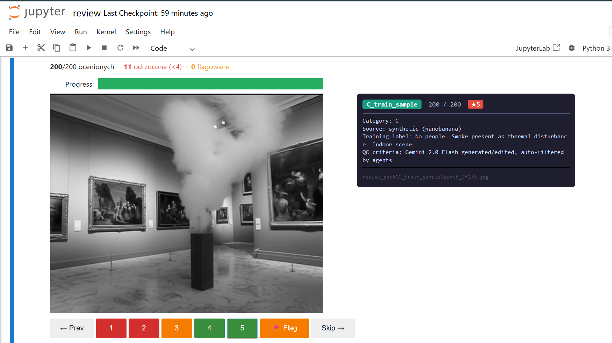

# Dataset QA Review Tool

Jupyter notebook do ręcznej weryfikacji jakości datasetu — sprawdza czy obrazy zgadzają się z opisami/anotacjami.



## Wymagania

```bash
pip install ipywidgets pillow pandas notebook
```

## Uruchomienie

```bash
cd review
python -m notebook review.ipynb
```

Otworzy się przeglądarka na `http://localhost:8888/notebooks/review.ipynb`.

## Workflow

1. **Cell 1** (`Shift+Enter`) — ładuje zdjęcia i wczytuje poprzedni postęp (resume działa automatycznie)
2. **Cell 2** (`Shift+Enter`) — uruchamia interfejs review
3. **Cell 3** — raport końcowy (uruchom po skończeniu)

## Interfejs

```
┌─────────────────────┬──────────────────────────────┐
│                     │ A_real_test        1 / 200   │
│    [zdjęcie]        │ ───────────────────────────  │
│                     │ Category: A_real              │
│                     │ Expected: person=True         │
│                     │          smoke=True           │
│                     │ Source: real thermal          │
│                     │ v6a response: ...             │
├─────────────────────┴──────────────────────────────┤
│ ← Prev  [1] [2] [3] [4] [5]  🚩 Flag  Skip →      │
│ Komentarz opcjonalny…                               │
└─────────────────────────────────────────────────────┘
```

**Skala oceny:**

| Ocena | Znaczenie |
|-------|-----------|
| 5 | Idealnie — obraz dokładnie odpowiada opisowi |
| 4 | OK — drobne niedokładności, akceptowalne |
| 3 | Wątpliwe — niepewne, lepiej sprawdzić |
| 2 | Błąd — zła kategoria, błędna liczba osób |
| 1 | Totalnie nie to — wieszak zamiast osoby, halucynacja |

**Przyciski:**
- **1–5** — oceń i przejdź automatycznie do następnego
- **🚩 Flag** — oznacz jako podejrzane (można łączyć z oceną)
- **← Prev / Skip →** — nawigacja bez oceniania

## Dane

- Zdjęcia: `../review_pack/` (6 folderów, ~200 obrazów)
- Wyniki: `results.csv` — zapisywane automatycznie po każdej ocenie
- Resume: ponowne uruchomienie Cell 1 wczytuje poprzedni postęp

## Struktura review_pack

```
review_pack/
├── A_real_test/      # smoke + people (45 imgs) — test set
├── B_real_test/      # people only   (45 imgs) — test set
├── C_real_test/      # smoke only    (41 imgs) — test set
├── A_train_sample/   # smoke + people (23 imgs) — training sample
├── B_train_sample/   # people only   (23 imgs) — training sample
└── C_train_sample/   # smoke only    (23 imgs) — training sample
```

Każde zdjęcie ma plik `.txt` obok z: kategorią, expected labels, źródłem i odpowiedzią modelu v6a.

## Raport (Cell 3)

Generuje podsumowanie z podziałem per kategoria + verdict GO/NO-GO (próg: 80% OK).

```
=== PODSUMOWANIE QA ===
Oceniono:       200 / 200 (100%)
OK (>=4):       189 (94.5%)
Odrzucone (<4): 11 (5.5%)

Verdict: GO — 94.5% OK (próg: 80%)
```

---

## Wyniki — 2026-02-25

**Reviewer:** Jakub Kornafel
**Data:** 25 lutego 2026
**Verdict: ✅ GO** — 94.5% OK (próg: 80%), pipeline potwierdzony, gotowe do skalowania 3x

| Kategoria | Opis | n | % OK | Avg |
|-----------|------|---|------|-----|
| A_real_test | smoke + people (test) | 45 | 91.1% | 4.1 |
| B_real_test | people only (test) | 45 | 97.8% | 5.0 |
| C_real_test | smoke only (test) | 41 | 100% | 4.8 |
| A_train_sample | smoke + people (train) | 23 | 87.0% | 4.0 |
| B_train_sample | people only (train) | 23 | 87.0% | 4.7 |
| C_train_sample | smoke only (train) | 23 | 100% | 5.0 |
| **Razem** | | **200** | **94.5%** | **4.6** |

**Odrzucone (11):** 4× A_real_test, 3× A_train_sample (w tym 1× ocena=1), 1× B_real_test, 3× B_train_sample.
Szczegółowa lista w `results.csv`. Pattern: syntetyczne obrazy kategorii A mają najsłabszą jakość.
