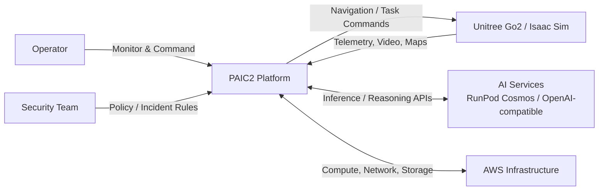
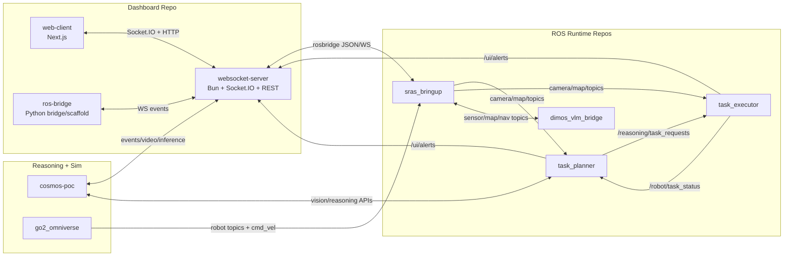
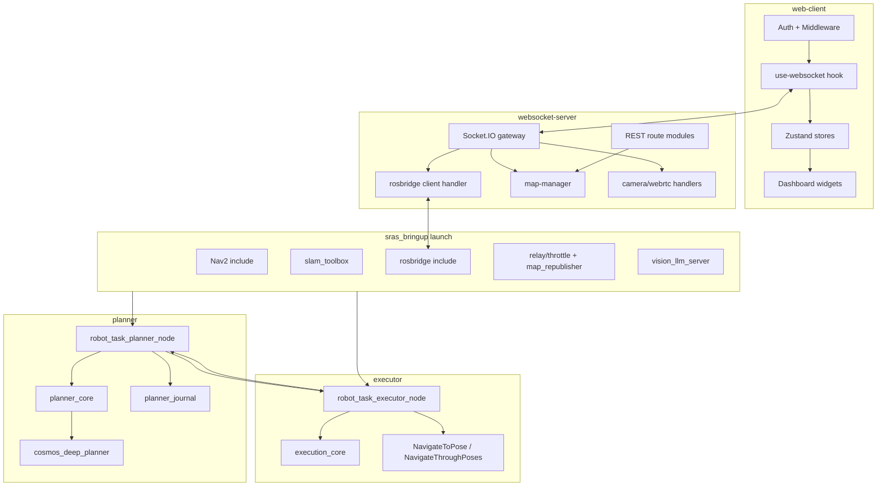
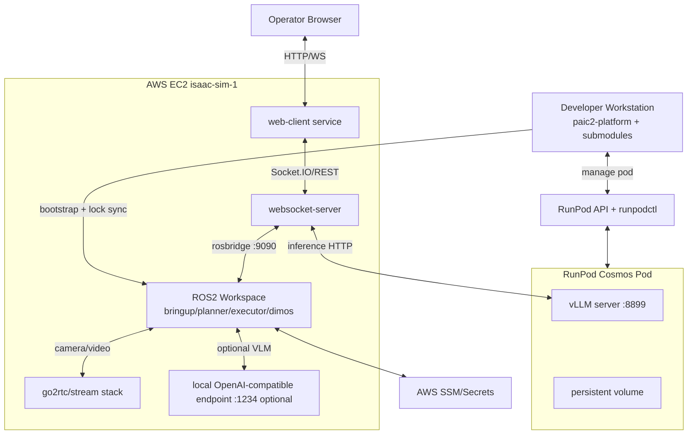

# PAIC2 C1-C5 Architecture and Dependency Graphs

Last verified: 2026-02-26.

This document provides connected architecture views from system context to runtime deployment/dependency level.

Note: C4 officially defines C1-C4. This document adds a practical `C5` runtime/dependency view for PAIC2 operations.

## C1: System Context

## Description

PAIC2 sits between physical/simulated robot systems and human operators. It integrates ROS2 runtime, reasoning services, dashboard control surfaces, and external AI/model infrastructure.

## Mermaid



## ASCII

```text
+------------------+      +---------------------+      +-------------------+
|    Operator      | ---> |    PAIC2 Platform   | ---> | Unitree/Isaac Sim |
| Security Team    | <--- | (Control + Reason)  | <--- |   Robot Runtime   |
+------------------+      +----------+----------+      +-------------------+
                                     |
                                     v
                         +----------------------------+
                         | AI Services + AWS Infra    |
                         | Cosmos / OpenAI / Compute  |
                         +----------------------------+
```

## C2: Container View

## Description

PAIC2 decomposes into containers that exchange ROS topics, Socket.IO events, HTTP APIs, and model inference calls.

## Mermaid



## ASCII

```text
[web-client] <---- Socket.IO/HTTP ----> [websocket-server] <----> [ros-bridge]
                                              |
                                              | rosbridge
                                              v
                                       [sras_bringup]
                                          |     |
                                          |     +--> [dimos_vlm_bridge]
                                          |
                              +-----------+-----------+
                              |                       |
                        [task_planner] <----------> [task_executor]
                              |
                              +---- alerts/status ---> [websocket-server]

[go2_omniverse] ---> ROS topics/cmd_vel ---> [sras_bringup]
[cosmos-poc] <---- socket/events/api ----> [websocket-server]
```

## C3: Component View

## Description

This level breaks down major containers into core components and tracks direct dependency lines.

## Mermaid



## ASCII

```text
web-client:
  Auth -> use-websocket -> stores -> widgets

websocket-server:
  gateway -> rosbridge-client
  gateway -> map-manager
  gateway -> camera/webrtc
  REST routes -> map-manager

planner:
  planner_node -> planner_core -> cosmos_deep_planner
  planner_node -> planner_journal

executor:
  executor_node -> execution_core -> Nav2 actions

bringup:
  Nav2 + SLAM + rosbridge + relays + map_republisher + vision_llm_server

cross-links:
  web-client <-> websocket-server
  planner <-> executor
  bringup -> planner/executor
```

## C4: Module Dependency View

## Description

This level maps implementation modules and package-level dependencies that affect build and runtime behavior.

## Mermaid

```mermaid
flowchart LR
    subgraph DBD[Dashboard modules]
      IDX[index.ts]
      RH[handlers/rosbridge/client.ts]
      MM[services/map-manager.ts]
      UH[use-websocket.ts]
      ST[@workspace/shared-types]
      IDX --> RH
      IDX --> MM
      UH --> ST
      RH --> MM
      IDX --> ST
    end

    subgraph ROSMOD[ROS modules]
      PLN[planner node/core]
      EXE[executor node/core]
      BRG[bringup launch]
      DIM[dimos nodes]
      BRG --> PLN
      BRG --> EXE
      PLN --> EXE
      EXE --> PLN
      BRG --> DIM
    end

    subgraph EXPMOD[Reasoning and sim modules]
      CAG[src/agents/v3/runtime.py]
      CCL[src/connectors/cosmos_client.py]
      CBR[src/bridge/ros2_cosmos_bridge.py]
      SIMRUN[go2_omniverse/ros2.py]
      CAG --> CCL
      CBR --> CAG
      SIMRUN --> BRG
      CBR --> IDX
    end
```

## ASCII

```text
Dashboard_Robotics:
  index.ts -> handlers/rosbridge/client.ts
  index.ts -> services/map-manager.ts
  use-websocket.ts -> @workspace/shared-types
  handlers/rosbridge/client.ts -> services/map-manager.ts

ROS repos:
  bringup launch -> planner node/core
  bringup launch -> executor node/core
  planner -> executor (task requests)
  executor -> planner (task status)
  bringup -> dimos nodes

Cosmos + Sim:
  runtime.py -> cosmos_client.py
  ros2_cosmos_bridge.py -> runtime.py
  go2_omniverse ros2.py -> bringup topic surface
  ros2_cosmos_bridge.py -> dashboard websocket/API
```

## C5: Runtime Deployment and External Dependency View

## Description

C5 tracks where components run, which external infrastructure they depend on, and the primary operational interfaces/ports.

## Mermaid



## ASCII

```text
[Developer WS] -- lock/bootstrap --> [AWS EC2: ROS2 Workspace + Dashboard]
      |                                         |
      | manage                                  | rosbridge:9090 / Socket.IO / REST
      v                                         v
[RunPod API + runpodctl] <--------------> [RunPod vLLM :8899 + volume]

[Operator Browser] <---- HTTP/WS ----> [web-client + websocket-server on EC2]
                                              |
                                              +--> [ROS2 bringup/planner/executor/dimos]
                                              |
                                              +--> [go2rtc stream stack]
                                              |
                                              +--> [optional local VLM :1234]

[AWS SSM/Secrets] <---- credentials/config ----> [EC2 runtime services]
```

## Dependency notes for tracking

- High-impact internal contracts:
- `/reasoning/task_requests` (planner -> executor)
- `/robot/task_status` (executor -> planner/dashboard)
- `/ui/set_task_state` (dashboard/operator -> planner/executor)
- `/ui/alerts` (planner/executor -> dashboard)
- High-impact external dependencies:
- rosbridge/Nav2/SLAM availability
- RunPod API and vLLM endpoint stability
- go2rtc streaming path and network configuration
- local or remote OpenAI-compatible endpoints for VLM services

## Known weak links

- underdeclared dependencies in `sras_ros2_bringup` and `sras_ros2_dimos_bridge` manifests
- JSON-over-String contracts in planner/executor increase schema drift risk
- dashboard event surface is broad and requires contract hardening
- simulation and Cosmos flows rely on external tooling and environment alignment
