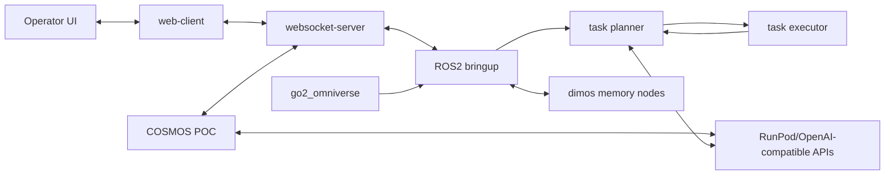

# PAIC2 One-Page Architecture Map

Last verified: 2026-02-26.

This page is the quick reference for how PAIC2 pieces connect across repos, runtime services, and external dependencies.

## Core map (Mermaid)



## Core map (ASCII)

```text
Operator <-> web-client <-> websocket-server <-> ROS2 bringup
                                         |            |      \
                                         |            |       -> dimos memory nodes
                                         |            |
                                         |            -> task planner <-> task executor
                                         |                     |
                                         |                     -> optional AI inference APIs
                                         |
                                         -> COSMOS POC <-> RunPod/OpenAI-compatible APIs

go2_omniverse (simulation) -> ROS2 bringup topic surface
```

## C1-C5 quick summary

| Level | Focus | Primary artifact |
|---|---|---|
| C1 | system context | operators, robot/sim, PAIC2, cloud AI/infra |
| C2 | containers | dashboard apps, ROS repos, reasoning/sim repos |
| C3 | components | planner/executor internals, websocket handlers, bringup launch units |
| C4 | modules | key file/package dependencies and contract paths |
| C5 | runtime/deployment | EC2/RunPod/services/ports/secrets integration |

## Critical contracts to track

- `/reasoning/task_requests` planner -> executor
- `/robot/task_status` executor -> planner/dashboard
- `/ui/set_task_state` operator/dashboard -> planner/executor
- `/ui/alerts` planner/executor -> dashboard
- rosbridge websocket flow between dashboard gateway and ROS2 runtime

## External dependency hotspots

- Nav2, SLAM, rosbridge availability
- go2rtc stream path and network config
- RunPod API + vLLM endpoint stability
- OpenAI-compatible endpoint availability for VLM/Cosmos paths

## Canonical detailed references

- `docs/architecture/c1-c5-architecture.md`
- `docs/architecture/system-overview.md`
- `docs/contracts/contracts-index.md`
- `docs/runbooks/risk-register.md`
